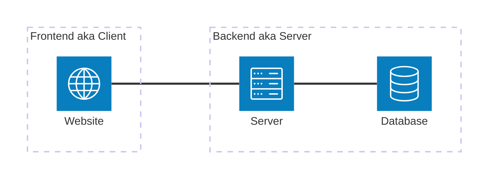

# Introduction

本專案用於 113-2 學期 DBMS 課程的後端開發教學。

Tech Stack:

- [ExpressJS](https://expressjs.com/)
- [MySQL](https://www.mysql.com/)

## Prerequisites

- [NodeJS](https://nodejs.org/en) installed
- [pnpm](https://pnpm.io/) installed

## 前後端分離架構

當今許多網站採取的架構都是前後端分離的架構。意即前端跟後端分開部署。
兩者之間的互動就是前端向後端發送 request，呼叫後端的 API。
本教學的著重點就是在 Backend 的部分，包含 API 的撰寫與和資料庫互動的部分。

### 為什麼要教用專案而不是自己寫一個 Server？

這是我設想「如果我是學生」會有的問題。如果你們心中不會有這個疑問，就跳過這段吧。

:::important[TL;DR]
簡單來說就是自己寫太複雜了。
:::

這個複雜是各種意義上的，我羅列幾個方面：

1. 在開發風格上大家各異，但使用框架可以確保大家程式碼基本上不會差太多。
2. 如果想自己設計封裝，讓大家可以一起用，那會有以下問題：
   - 路由的實現很複雜：假設你用最簡單的 linear router，那起碼也要實現
     - 正則表達式
     - 路由的嵌套
   - 文檔要怎麼設計才可以讓大家都有辦法理解

在上述這兩個成本都太高的情況下，使用已經寫好的網路框架是一個比較合理且快速的選擇。

## Express JS

Express 是一個歷史悠久的輕量化 web app framework。

用 framework 的好處就是有一群更加專業的人，已經為你寫好許多實現起來非常蠻煩且容易出錯的功能，
