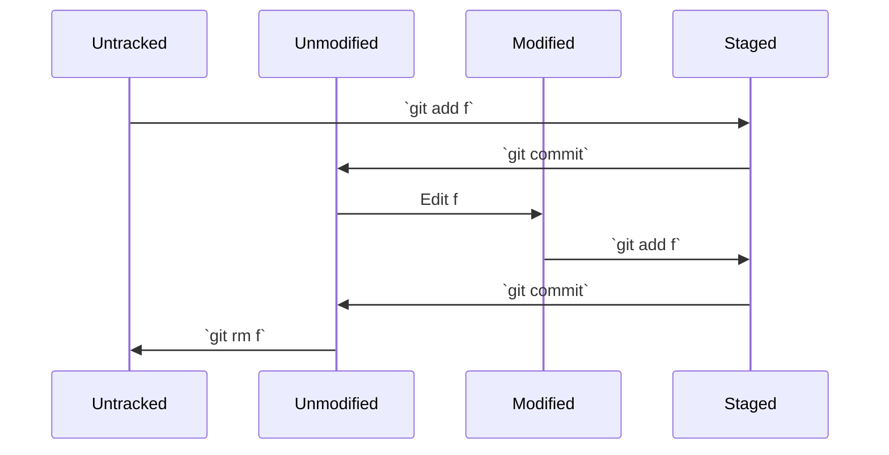

# Basic Concepts

## Status of a File

檔案（或變更）通常有四種狀態

- Untracked: 這個檔案還沒被 Git tracked
- Unmodified: 這個檔案沒有新的變更
- Modified: 這個檔案有新的變更
- Staged: 這個檔案（變更）被存在暫存區

他們之間的關係與相關指令(surrounded by \`\`)可以用以下的圖表表示（假設檔案為 `f`）:

## Branch

這部分可以等到我講到 [Branch](/docs/category/branch) 時再看。

:::tip[Git Branch]
Git branch 是一個可以開出獨立的空間的功能，可以等到一切準備就緒時才把東西合併起來。
只要你在自己的 branch 上面，無論你怎麼改程式碼，甚至是把東西刪光光，都不會影響到別人的東西（只要沒有合併回去，這個我等等說）。
:::

這在協作的時候有很大的幫助。因為大家東改西改，你做到一半的東西很可能會隔天起床就被人改掉。
這樣一來，重新梳理邏輯就會變成一件很麻煩的事情，大家可以想想用 google docs 跟組員們一起寫報告的場景。
那應該不是一個美好的回憶。

順帶一提，以下是我對我的 branches 的命名邏輯，提供各位參考

- 功能：`feat/feature-summary`
- 文件：`doc/documentation-summary`
- 修復：`fix/fixed-function`
