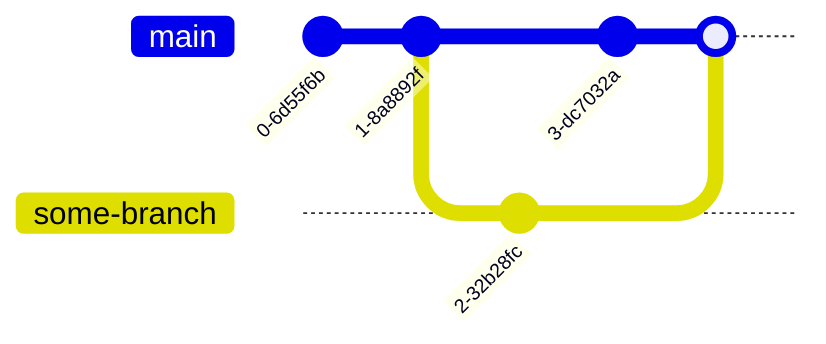

# Conflict

不知道有沒有人已經心中有疑問：

> 嘿助教
> 如果在我進行 merge 前，我編輯的檔案被改過了呢？
> 那應該要以誰的變更為準呢？

問得好，這就是發生 conflict 的情況，也就是我準備要介紹的東西。
_**所謂的「以誰的變更為準」的判斷，Git 是不會自己評斷的，而是交由 developer**_。

我們先來視覺化一下會發生 conflict 的情況，給大家一個更具象化的畫面。不過我這邊先不討論另一條 branch merge 的情況，我簡化成一個 commit：



這時候就會發生 conflict。我們來實際操作一下。

## Create a Conflict

先處理準備工作當作一個複合式的練習：

:::tip[Practice]
這個練習幾乎包含了目前為止所有的主要操作。
如果可以順利完成，說明你截至此刻都有順利跟上！

- 創造 `doc/features` branch
- 在 `README.md` 添加 "## Features"
- 做一個 commit
- 切換回 `main` branch
  :::

好，先別 merge，我們在 `main` branch 製造一個 commit。
這邊我把三條指令一起打完：

```bash
$ echo "## Installation" >> README.md
$ git add README.md
$ git commit -m "Add: Installation section"
```

接著看一下 log:

```bash
$ git log --oneline
d2e483f (HEAD -> main) Add: Installation section
98ad8b1 Add: Introduction section
436b67d First Commit
```

好，我們來 merge `doc/features` branch:

```bash
$ git merge doc/features
Auto-merging README.md
CONFLICT (content): Merge conflict in README.md
Automatic merge failed; fix conflicts and then commit the result.
```

在`README.md` 發生 merge conflict!
我們來看看是怎麼回事:

```shell
$ git status
On branch main
You have unmerged paths.
  (fix conflicts and run "git commit")
  (use "git merge --abort" to abort the merge)

Unmerged paths:
  (use "git add <file>..." to mark resolution)
        both modified:   README.md

no changes added to commit (use "git add" and/or "git commit -a")
```

Okay，它給我們一些提示，我來逐項解釋：

- 解完 conflict 後下指令 `git commit`
- 放棄 merge: `git merge --abort`

## Resolve a Conflict

我們怎麼可能現在放棄。用編輯器打開 `README.md`，你看到的應該像這樣：

```
# DBMS TA Session Git Example
## Introduction
<<<<<<< HEAD
## Installation
=======
## Features
>>>>>>> doc/features
```

看起來很醜，他說的是

- 最近的更動是 `<<<<<<< HEAD` 跟 `=======` 之間的東西
- 想合併的分支更動的是 `=======` 跟 `>>>>>>> doc/features` 之間的東西

這時候你可以編輯檔案，去確認自己要留下什麼。

:::important
記得把 `<<<<<<< HEAD`, `=======`, 和 `>>>>>>> doc/features` 刪除掉。
他們不是你的程式碼／文件的一部分。
:::

在我們的情景中，"Installation" 跟 "Features" 都是我們要留下的段落。

編輯完之後，我們可以繼續了，一樣 `git add` 它。

```bash
$ git status
On branch main
All conflicts fixed but you are still merging.
  (use "git commit" to conclude merge)

Changes to be committed:
        modified:   README.md
```

好，我們已經 fix 完 conflict ，並且已經把 changes 加入 staged。所以可以來 commit 了。
我們按照指示 `git commit`。

```=
Merge branch 'doc/features'

# Conflicts:
#       README.md
#
# It looks like you may be committing a merge.
# If this is not correct, please run
#       git update-ref -d MERGE_HEAD
# and try again.


# Please enter the commit message for your changes. Lines starting
# with '#' will be ignored, and an empty message aborts the commit.
#
# On branch main
# All conflicts fixed but you are still merging.
#
# Changes to be committed:
#       modified:   README.md
#
```

文件的第一行是 commit message，之後 commit 的時候如果沒有下 `-m "<MESSAGE>"` 就會進到終端機編輯器裡面自己寫 commit message。

我們就不更改了。來說一下怎麼退出，我猜大家的終端機編輯器不是 nano 就是 vi(m)。

:::note[nano]
如果你的編輯器底下有

```
^G Get Help  ^O WriteOut  ^R Read File ^Y Prev Pg   ^K Cut Text  ^C Cur Pos
^X Exit      ^J Justify   ^W Where is  ^V Next Pg   ^U UnCut Text^T To Spell
```

那應該是 nano，這邊不介紹詳細用法，可以直接按 `<control>x` 退出。
:::

:::note[vi(m)]
如果你的編輯器底下空空如也，那應該是 vi(m)。可以輸入 `<esc>:q` 退出。
:::

退出後會看到以下結果：

```bash
$ git commit
[main d05e621] Merge branch 'doc/features'
```

恭喜！你解完了第一個 merge conflict！
