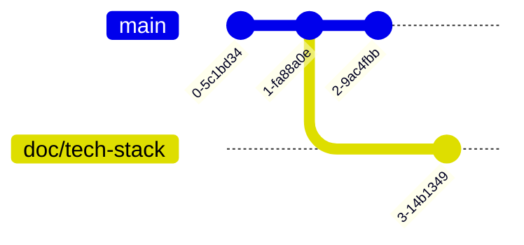

# Git Stash

## Why I Fail in Switching Branches?

### Why We Need Stash?

我們先重複一下製造 conflict 前的準備步驟：

```bash
$ git branch doc/tech-stack
$ echo "Something not expected" >> README.md && git add README.md && git commit -m "Add: something not expected"
$ git switch doc/tech-stack
$ echo "## Tech Stack" >> README.md
```

這時我們的 status 像這樣：

```bash
$ git status
On branch doc/tech-stack
Changes not staged for commit:
  (use "git add <file>..." to update what will be committed)
  (use "git restore <file>..." to discard changes in working directory)
        modified:   README.md

no changes added to commit (use "git add" and/or "git commit -a")
```

這時想切回 `main` 看一眼，卻爆出一個錯誤：

```bash
$ git switch main
error: Your local changes to the following files would be overwritten by checkout:
        README.md
Please commit your changes or stash them before you switch branches.
Aborting
```

他說 "your local changes to the following files would be overwritten by checkout"。
並且給了我們一點提示："Please commit your changes or stash them before you switch branches"。

這是為什麼呢？我們先來看看此時的 git graph:



這是因為 `doc/tech-stack` branch 上的變更跟 `main` 上創造 `doc/tech-stack` branch 後的變更發生衝突了。

還記得剛剛 Git 給我們的建議嗎？"Please commit your changes or stash them before you switch branches"

如果 commit 了就當然可以切換了，因為你不會把變更帶到 `main` branch 上。這對現在的你來說應該不難理解。

那 stash 是什麼呢？這就是本小節的主角。

:::tip[Git Stash]
Stash 可以幫我們暫存我們的變更，
除了切換 branch 時不要污染到其他 branch，
一方面也可以用來讓自己檢查原本的東西是什麼樣子。
:::

我們來 stash 一下！輸入指令

```bash
$ git stash
Saved working directory and index state WIP on doc/tech-stack: 0c3c0f5 First commit
```

這時候看 status 就會不一樣：

```bash
$ git status
On branch doc/tech-stack
nothing to commit, working tree clean
```

因為你的 changes 已經被 stash 了：

```bash
$ git stash list
stash@{0}: WIP on doc/tech-stack: 0c3c0f5 First commit
```

你應該會發現這時你可以自由的切換 branch，這裡不展示。

如果要把它恢復，再把它 pop 出來就好：

```bash
$ git stash pop 0
On branch doc/tech-stack
Changes not staged for commit:
  (use "git add <file>..." to update what will be committed)
  (use "git restore <file>..." to discard changes in working directory)
        modified:   README.md

no changes added to commit (use "git add" and/or "git commit -a")
Dropped refs/stash@{0} (3feea9487a478929de2adc0e6e19a55fee00d498)
```

可以看到已經變回了原來的 status，接下來便可以繼續工作。

:::note
比起 Git stash，我有一個更愛用的工具叫 Git worktree。
這個會更抽象一點，所以放在 Appendix，有興趣的話可以去看看。
:::
