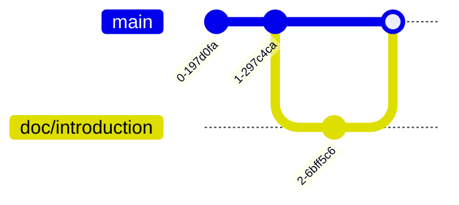

# Merge a Branch

我們的目標是把自己在 `doc/introduction` 的東西合併回到 `main` 分支。

首先我們要先確保自己在 `main` 分支上，有鑒於我們剛剛已經回到 `main` 上我這邊就不示範了。不過剛剛我們已經練習過了，所以我相信你可以的。我們來合併 `doc/information`

```bash
$ git merge doc/introduction
Updating 436b67d..98ad8b1
Fast-forward
 README.md | 1 +
 1 file changed, 1 insertion(+)
```

看起來順利合併了。我們來看一下 log:

```bash
$ git log --oneline
98ad8b1 (HEAD -> main, doc/introduction) Add: Introduction section
436b67d First Commit
```

發現了嗎？我們在 `doc/introduction` 上的編輯已經加入 `main` branch 的編輯歷史了。

有鑒於我們已經用完 `doc/introduction` branch 了，我們來把它刪除：

```bash
$ git branch -D doc/introduction
Deleted branch doc/introduction (was 98ad8b1).
```

這樣一來就順利刪除了，我們可以列出所有分支檢查一下：

```bash
$ git branch
* main
```

刪除成功！這樣我們就順利的完成了第一個 git branch 的練習。

這時候 git graph 像這樣：


