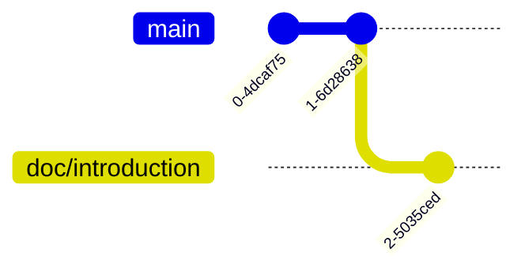

# Switch Branch - Working on `doc/introduction` Branch

我們先把目標移動到 `doc/introduction` 上

```bash
$ git switch doc/introduction
```

這時候用 `git branch` 就會看到

```bash
$ git branch
* doc/introduction
  main
```

這時候 git graph 像這樣：


接下來我們來編輯它，一樣用寫入的指令：

```bash
$ echo "## Introduction" >> README.md
```

我們來看看現在 repository 的情況：

```bash
$ git status
On branch doc/introduction
Changes not staged for commit:
  (use "git add <file>..." to update what will be committed)
  (use "git restore <file>..." to discard changes in working directory)
        modified:   README.md

no changes added to commit (use "git add" and/or "git commit -a")
```

可以看到我們有一個沒有 `staged` 或 `commit` 的 changes。

剛剛沒有提到，我們其實有一個很方便的工具可以瀏覽我們的變更，也就是 `git diff`：

```bash
$ git diff
diff --git a/README.md b/README.md
index fffba55..05c2fe1 100644
--- a/README.md
+++ b/README.md
@@ -1 +1,2 @@
 # DBMS TA Session Git Example
+## Introduction
```

這樣就可以看到我們的變更。我推薦各位一個 command line app [delta](https://github.com/dandavison/delta)。
安裝完畢設定完後會看起來像這樣(以下取自 `README.md` in the project repo)：


非常美麗且直觀，是我的愛用工具之一。

:::tip[Practice]
試著 commit 它吧！
這是第二次自己 commit 了，相信會變得很熟悉的！
:::

來展示一下為什麼我說在 branch 上工作是獨立的。

我們先來看看 `doc/introduction` 的 log 吧：

```bash
$ git log --oneline
98ad8b1 (HEAD -> doc/introduction) Add: Introduction section
436b67d (main) First Commit
```

:::tip[Practice]
切換到 `main` branch 吧！
:::

接著是 `main` branch 的 log：

```bash
$ git log --oneline
436b67d (HEAD -> main) First Commit
```

可以看到 `main` branch 上並沒有 `98ad8b1` 這個編號的 commit。

這時候 git graph 像這樣：


