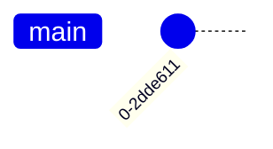
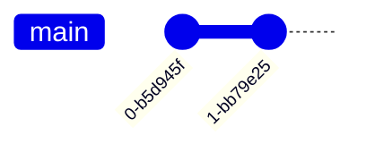

# First Commit

為求方便，我直接提供指令。並簡略描述在做什麼：

```bash
$ echo "# DBMS TA Session Example" >> README.md
```

這是對 `README.md` 寫入 "DBMS TA Session Example"。

`.md` 是 Markdown 檔案。這（應該）是目前最 popular 且最 common 的 repo 文檔格式。今天我不會解釋太多語法，大家照抄就可以了。Markdown 格式的變體繁多，但基調是一樣的，這邊推薦 [Github 的說明文件](https://docs.github.com/en/get-started/writing-on-github/getting-started-with-writing-and-formatting-on-github/basic-writing-and-formatting-syntax) ，他寫得蠻清楚的。如果之後遇到解析不如預期的情況，再另外查就好。

我們可以利用指令 `git status` 看目前的 repo 情況。如果完全照做的話，結果應該類似這樣：

```
On branch main

No commits yet

Untracked files:
  (use "git add <file>..." to include in what will be committed)
        README.md

nothing added to commit but untracked files present (use "git add" to track)
```

:::note
相關的知識點是 [Status of a File](#Status-of-a-File)，不熟的人可以去複習一下。
:::

可以看到，因為我們的 `README.md` 並沒有被 Git 追蹤的紀錄，所以是 Untracked file。

首先，我們先把我們的新檔案加入 Staged。輸入:

```bash
$ git add README.md
```

這時我們可以再看一下有沒有變化，輸入指令 `git status`：

```
On branch main

No commits yet

Changes to be committed:
  (use "git rm --cached <file>..." to unstage)
        new file:   README.md
```

可以看到他現在是 Changes to be committed。

接下來我們來 commit 它。以下是一個比較簡單的方法：

```bash
$ git commit -m "First Commit"
[main (root-commit) 436b67d] First Commit
 1 file changed, 1 insertion(+)
 create mode 100644 README.md
```

這樣就順利的完成 Commit! 我們可以來看看我們的 repo 歷史：

```bash
$ git log
commit 0c3c0f52599dc651614f7e368731e80da2ee159d (HEAD -> main)
Author: HarveyTung <haotingting30@gmail.com>
Date:   Tue Jan 14 14:45:21 2025 +0800

    First commit

$ git log --oneline  # refers to <Tip>
0c3c0f5 (HEAD -> main) First commit
```

commit 的格式是 `<hash> <info> <commit-message>`
`<hash>` 的算法有興趣可以自己去查，我們先知道他是 commit 的 id 即可。
我們的 hash 應該會不一樣，這是正常的。

:::tip
利用 `--oneline` 參數可以讓他一個 commit 一行的顯示。
這樣瀏覽時會簡潔很多。
我接下來看 log 都會使用這個。
:::

這時你的 git graph 像這樣：



:::tip[Practice]
新增一個檔案，然後 commit 它吧！
:::

做完後，你的 git graph 像這樣：


