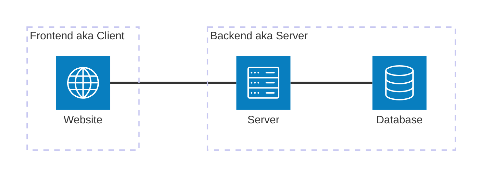

# Introduction

This project supports the backend development tutorials for the DBMS course in the second semester of academic year 113 (spring 2025).

Tech Stack:

- [ExpressJS](https://expressjs.com/)
- [MySQL](https://www.mysql.com/)

## Prerequisites

- [NodeJS](https://nodejs.org/en) installed
- [pnpm](https://pnpm.io/) installed

## Separating the Frontend and Backend

Many websites deploy their frontend and backend separately.
They interact when the frontend sends requests to the backend's APIs.
This tutorial focuses on the backend, including writing APIs and interacting with a database.

### Why teach a framework instead of writing a server from scratch?

This is a question I imagine asking as a student. If you are not wondering about it, feel free to skip this part.

:::important[TL;DR]
The short answer is that writing everything yourself is too complicated.
:::

There are several kinds of complexity involved:

1. Everyone has a different development style. A framework helps keep the overall structure of our code consistent.
2. If we design our own abstraction for everyone to use, we face problems such as:
   - Routing is complicated. Even a simple linear router needs support for things like:
     - Regular expressions
     - Nested routes
   - How to write documentation that everyone can understand

Given these costs, using an existing web framework is a more practical and faster choice.

## Express JS

Express is a lightweight web application framework with a long history.

A framework gives you features already implemented by experienced developers, including many that would be tedious and error-prone to write yourself.
