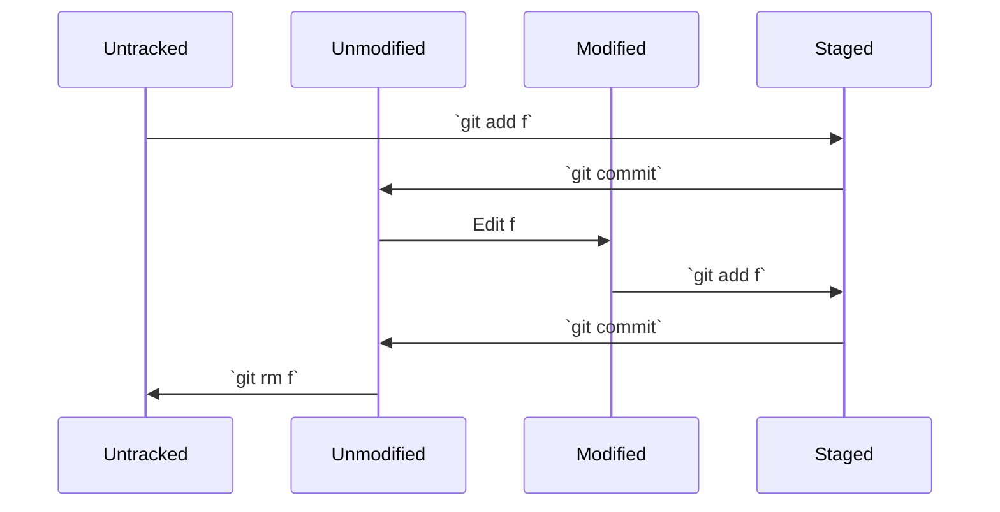

# Basic Concepts

## Status of a File

Files or changes commonly fall into four states:

- Untracked: Git is not yet tracking the file.
- Unmodified: The file has no new changes.
- Modified: The file has new changes.
- Staged: The file's changes are in the staging area.

The diagram below shows their relationships and the relevant commands (surrounded by backticks), assuming a file named `f`:

## Branch

You can return to this section when we get to [Branch](/docs/category/branch).

:::tip[Git Branch]
A Git branch provides a separate line of work that can be merged when everything is ready.
Changes committed on your branch, even deleting all its files, do not affect other branches until you merge them. We will cover merging shortly.
:::

This is especially useful for collaboration. Otherwise, changes from teammates could leave yesterday's unfinished work looking completely different this morning.
Working out the logic again can be frustrating. Think about writing a report with teammates in Google Docs.
That may not be a pleasant memory.

For reference, here is how I name my branches:

- Features: `feat/feature-summary`
- Documentation: `doc/documentation-summary`
- Fixes: `fix/fixed-function`
