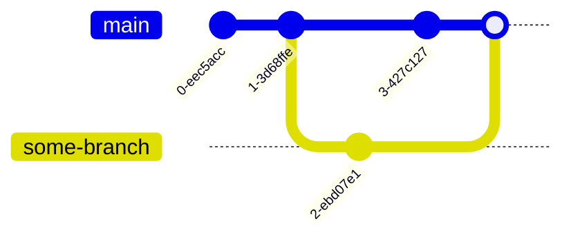

# Conflict

You may already be wondering:

> Hey, TA,
> what if someone changes the file I edited before I merge?
> Whose changes should we keep?

Good question! That is a conflict, which is our next topic.
_**Git leaves the decision about which changes to keep to the developer.**_

Let's visualize a conflict to make it more concrete. For simplicity, I will represent the other branch's work as a single commit:



This produces a conflict. Let's try it ourselves.

## Create a Conflict

Start with some preparation as a combined exercise:

:::tip[Practice]
This exercise covers almost all the main operations we have learned so far.
If you can complete it, you have kept up with everything to this point!

- Create a `doc/features` branch.
- Add "## Features" to `README.md`.
- Make a commit.
- Switch back to `main`.
  :::

Before merging, create a commit on `main`.
Here are the three commands together:

```bash
$ echo "## Installation" >> README.md
$ git add README.md
$ git commit -m "Add: Installation section"
```

Then check the log:

```bash
$ git log --oneline
d2e483f (HEAD -> main) Add: Installation section
98ad8b1 Add: Introduction section
436b67d First Commit
```

Now merge `doc/features`:

```bash
$ git merge doc/features
Auto-merging README.md
CONFLICT (content): Merge conflict in README.md
Automatic merge failed; fix conflicts and then commit the result.
```

There is a merge conflict in `README.md`!
Let's see what happened:

```shell
$ git status
On branch main
You have unmerged paths.
  (fix conflicts and run "git commit")
  (use "git merge --abort" to abort the merge)

Unmerged paths:
  (use "git add <file>..." to mark resolution)
        both modified:   README.md

no changes added to commit (use "git add" and/or "git commit -a")
```

Git gives us some hints. Let's go through them:

- After resolving the conflict, run `git commit`.
- To abandon the merge, run `git merge --abort`.

## Resolve a Conflict

We are not giving up now! Open `README.md` in your editor. It should look like this:

```
# DBMS TA Session Git Example
## Introduction
<<<<<<< HEAD
## Installation
=======
## Features
>>>>>>> doc/features
```

It looks messy. Here is what the markers mean:

- The current branch's content is between `<<<<<<< HEAD` and `=======`.
- The incoming branch's content is between `=======` and `>>>>>>> doc/features`.

Edit the file to keep the content you want.

:::important
Remember to remove `<<<<<<< HEAD`, `=======`, and `>>>>>>> doc/features`.
They are not part of your code or documentation.
:::

In our example, we want to keep both "Installation" and "Features."

After editing, stage the file with `git add` again.

```bash
$ git status
On branch main
All conflicts fixed but you are still merging.
  (use "git commit" to conclude merge)

Changes to be committed:
        modified:   README.md
```

We have resolved the conflict and staged the changes, so we can commit.
Follow the instruction and run `git commit`.

```=
Merge branch 'doc/features'

# Conflicts:
#       README.md
#
# It looks like you may be committing a merge.
# If this is not correct, please run
#       git update-ref -d MERGE_HEAD
# and try again.


# Please enter the commit message for your changes. Lines starting
# with '#' will be ignored, and an empty message aborts the commit.
#
# On branch main
# All conflicts fixed but you are still merging.
#
# Changes to be committed:
#       modified:   README.md
#
```

The first line is the commit message. When you commit without `-m "<MESSAGE>"`, Git opens a terminal editor so you can write one.

We will keep the suggested message. Let's cover how to exit; your editor is probably nano or vi(m).

:::note[nano]
If the bottom of your editor shows:

```
^G Get Help  ^O WriteOut  ^R Read File ^Y Prev Pg   ^K Cut Text  ^C Cur Pos
^X Exit      ^J Justify   ^W Where is  ^V Next Pg   ^U UnCut Text^T To Spell
```

it is probably nano. We will skip the details; press `<control>x` to exit.
:::

:::note[vi(m)]
If the bottom is mostly empty, it is probably vi(m). Enter `<esc>:q` to exit.
:::

After exiting, you should see:

```bash
$ git commit
[main d05e621] Merge branch 'doc/features'
```

Congratulations! You have resolved your first merge conflict!
