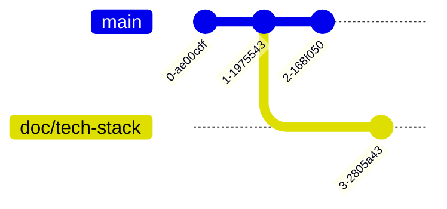

# Git Stash

## Why I Fail in Switching Branches?

### Why We Need Stash?

Let's repeat the preparation steps from the conflict example:

```bash
$ git branch doc/tech-stack
$ echo "Something not expected" >> README.md && git add README.md && git commit -m "Add: something not expected"
$ git switch doc/tech-stack
$ echo "## Tech Stack" >> README.md
```

Our status now looks like this:

```bash
$ git status
On branch doc/tech-stack
Changes not staged for commit:
  (use "git add <file>..." to update what will be committed)
  (use "git restore <file>..." to discard changes in working directory)
        modified:   README.md

no changes added to commit (use "git add" and/or "git commit -a")
```

Trying to switch back to `main` produces an error:

```bash
$ git switch main
error: Your local changes to the following files would be overwritten by checkout:
        README.md
Please commit your changes or stash them before you switch branches.
Aborting
```

It says, "your local changes to the following files would be overwritten by checkout."
It also suggests: "Please commit your changes or stash them before you switch branches."

Why? Let's inspect the Git graph:



Our uncommitted changes on `doc/tech-stack` conflict with changes made on `main` since the branch diverged.

Remember Git's suggestion? "Please commit your changes or stash them before you switch branches."

Committing would let us switch, because we would no longer be carrying those uncommitted changes to `main`. That should make sense by now.

What about stash? That is the focus of this section.

:::tip[Git Stash]
Stash temporarily saves our uncommitted changes.
It lets us switch branches without carrying those changes along,
and also lets us inspect the original working tree without them.
:::

Let's stash the changes! Enter:

```bash
$ git stash
Saved working directory and index state WIP on doc/tech-stack: 0c3c0f5 First commit
```

The status now looks different:

```bash
$ git status
On branch doc/tech-stack
nothing to commit, working tree clean
```

That is because the changes have been stashed:

```bash
$ git stash list
stash@{0}: WIP on doc/tech-stack: 0c3c0f5 First commit
```

You should now be able to switch branches freely. I will leave that for you to try.

To restore the changes, pop the stash:

```bash
$ git stash pop 0
On branch doc/tech-stack
Changes not staged for commit:
  (use "git add <file>..." to update what will be committed)
  (use "git restore <file>..." to discard changes in working directory)
        modified:   README.md

no changes added to commit (use "git add" and/or "git commit -a")
Dropped refs/stash@{0} (3feea9487a478929de2adc0e6e19a55fee00d498)
```

The original status is back, and we can continue working.

:::note
I have another favorite tool for this kind of workflow: Git worktree.
It is a little more abstract, so I put it in the appendix. Take a look if you are interested.
:::
