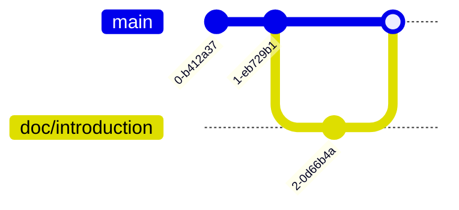

# Merge a Branch

Our goal is to merge the work on `doc/introduction` back into `main`.

First, make sure you are on `main`. We already switched back, so I will not repeat that step. You have practiced it, so I trust you can do it. Now merge `doc/introduction`:

```bash
$ git merge doc/introduction
Updating 436b67d..98ad8b1
Fast-forward
 README.md | 1 +
 1 file changed, 1 insertion(+)
```

The merge appears to have succeeded. Let's check the log:

```bash
$ git log --oneline
98ad8b1 (HEAD -> main, doc/introduction) Add: Introduction section
436b67d First Commit
```

Notice that the changes from `doc/introduction` are now part of the history of `main`.

Since we are finished with `doc/introduction`, let's delete it:

```bash
$ git branch -D doc/introduction
Deleted branch doc/introduction (was 98ad8b1).
```

The branch was deleted. List all branches to check:

```bash
$ git branch
* main
```

Success! We have completed our first Git branch exercise.

The Git graph now looks like this:


