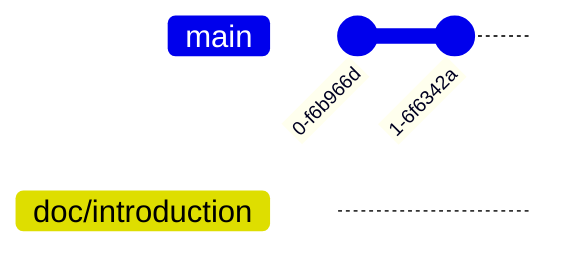
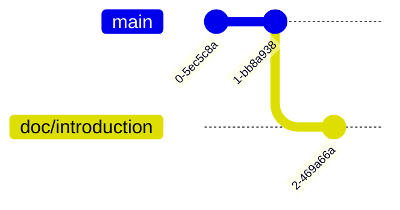

# Switch Branch - Working on `doc/introduction` Branch

First, switch to `doc/introduction`:

```bash
$ git switch doc/introduction
```

Running `git branch` now shows:

```bash
$ git branch
* doc/introduction
  main
```

The Git graph looks like this:



Next, edit the file using another command that writes to it:

```bash
$ echo "## Introduction" >> README.md
```

Let's check the repository's current state:

```bash
$ git status
On branch doc/introduction
Changes not staged for commit:
  (use "git add <file>..." to update what will be committed)
  (use "git restore <file>..." to discard changes in working directory)
        modified:   README.md

no changes added to commit (use "git add" and/or "git commit -a")
```

We have a change that has neither been staged nor committed.

I have not mentioned it yet, but `git diff` is a convenient way to inspect changes:

```bash
$ git diff
diff --git a/README.md b/README.md
index fffba55..05c2fe1 100644
--- a/README.md
+++ b/README.md
@@ -1 +1,2 @@
 # DBMS TA Session Git Example
+## Introduction
```

This shows our changes. I also recommend the command-line application [delta](https://github.com/dandavison/delta).
After installation and configuration, it looks like this (image from the project's `README.md`):


It is attractive and easy to read, and one of my favorite tools.

:::tip[Practice]
Try committing the change!
This is your second independent commit, so it should be starting to feel familiar.
:::

Let's demonstrate what I mean by working independently on a branch.

First, inspect the log on `doc/introduction`:

```bash
$ git log --oneline
98ad8b1 (HEAD -> doc/introduction) Add: Introduction section
436b67d (main) First Commit
```

:::tip[Practice]
Switch to `main`!
:::

Here is the log on `main`:

```bash
$ git log --oneline
436b67d (HEAD -> main) First Commit
```

The commit with ID `98ad8b1` is absent from `main`.

The Git graph now looks like this:


