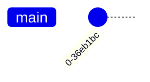
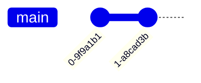

# First Commit

For convenience, I will give you the commands and briefly explain what they do:

```bash
$ echo "# DBMS TA Session Example" >> README.md
```

This writes "DBMS TA Session Example" to `README.md`.

`.md` denotes a Markdown file, a very common format for repository documentation. I will not cover much syntax today; you can copy the examples. Markdown has many variants, but the basics are similar. I recommend [GitHub's guide](https://docs.github.com/en/get-started/writing-on-github/getting-started-with-writing-and-formatting-on-github/basic-writing-and-formatting-syntax), which explains it clearly. If rendering behaves unexpectedly later, look into the particular case then.

Use `git status` to inspect the repository. If you followed the steps exactly, the result should look like this:

```
On branch main

No commits yet

Untracked files:
  (use "git add <file>..." to include in what will be committed)
        README.md

nothing added to commit but untracked files present (use "git add" to track)
```

:::note
The related concept is [Status of a File](/docs/Git/basic-concepts#status-of-a-file). Review it if needed.
:::

Since Git has no tracking record for `README.md`, it appears as an untracked file.

First, stage the new file. Enter:

```bash
$ git add README.md
```

Run `git status` again to see what changed:

```
On branch main

No commits yet

Changes to be committed:
  (use "git rm --cached <file>..." to unstage)
        new file:   README.md
```

It now appears under "Changes to be committed."

Next, commit it. Here is a simple way:

```bash
$ git commit -m "First Commit"
[main (root-commit) 436b67d] First Commit
 1 file changed, 1 insertion(+)
 create mode 100644 README.md
```

The commit succeeded! Let's look at the repository's history:

```bash
$ git log
commit 0c3c0f52599dc651614f7e368731e80da2ee159d (HEAD -> main)
Author: HarveyTung <haotingting30@gmail.com>
Date:   Tue Jan 14 14:45:21 2025 +0800

    First commit

$ git log --oneline  # refers to <Tip>
0c3c0f5 (HEAD -> main) First commit
```

The displayed format is `<hash> <info> <commit-message>`.
Feel free to look up how the hash is calculated. For now, think of it as the commit's ID.
Your hash will probably differ from mine. That is normal.

:::tip
The `--oneline` option displays each commit on one line.
This makes the history more concise and easier to browse.
I will use it for subsequent log examples.
:::

Your Git graph now looks like this:



:::tip[Practice]
Create another file and commit it!
:::

Afterward, your Git graph should look like this:


